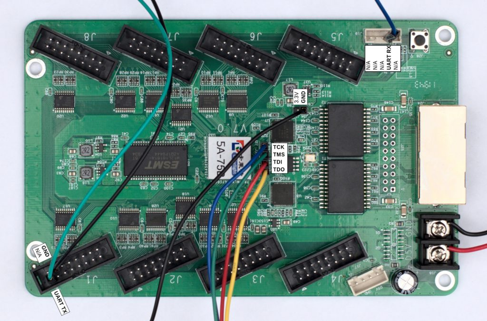

### Notes for Colorlight-5A-75B

#### Colorlight 5A-75B pinout

```
|-------|------|
| J30   | TDO  |
| J29   | TDI  |
| J28   | TMS  |
| J27   | TCK  |
|-------|------|
```



ATTENTION: For exact pinout (which varies depending on the board revision),
please see https://github.com/q3k/chubby75/tree/master/5a-75b.

Image Credit: [Anton Blanchard](https://twitter.com/antonblanchard/status/1231778939888029696).

#### Programming Colorlight-5A-75B using Bus Pirate with OpenOCD:

```
sudo openocd -s /usr/local/share/openocd -f buspirate-flash.cfg
```

#### Programming Colorlight-5A-75B using CMSIS-DAP with OpenOCD:

```
sudo openocd -s /usr/local/share/openocd -f cmsisdap-flash.cfg
```

#### Programming Colorlight-5A-75B using STM32 + DirtyJTAG with UrJTAG:

Programming Colorlight 5A-75B (15$ ECP5 FPGA board) with 2$ STM32 "Blue Pill"
based JTAG adapter is fun. Thanks to DirtyJTAG and UrJTAG! The `Blue Pill`
might be the cheapest JTAG programmer around (< 2 USD on AliExpress)?

Flash [DirtyJTAG](https://github.com/jeanthom/DirtyJTAG) firmware to `Blue
Pill` (STM32F103C8T6):

```
st-flash write dirtyjtag.bluepill.bin 0x8000000
```

DirtyJTAG Pinout:

The `bluepill` build of DirtyJTAG has the following pinout:

| STM32 | JTAG |
|-------|------|
| PA0   | TDI  |
| PA1   | TDO  |
| PA2   | TCK  |
| PA3   | TMS  |
| PA4   | TRST |
| PA5   | SRST |

Run `blinky` example on the FPGA:

```
$ sudo jtag

UrJTAG 2019.12 #ae2cacce
Copyright (C) 2002, 2003 ETC s.r.o.
Copyright (C) 2007, 2008, 2009 Kolja Waschk and the respective authors

UrJTAG is free software, covered by the GNU General Public License, and you are
welcome to change it and/or distribute copies of it under certain conditions.
There is absolutely no warranty for UrJTAG.

warning: UrJTAG may damage your hardware!
Type "quit" to exit, "help" for help.

jtag> bsdl path .
jtag> cable dirtyjtag
jtag> detect
IR length: 8
Chain length: 1
Device Id: 01000001000100010001000001000011 (0x41111043)
  Filename:     ./BSDLLFE5U25FCABGA256.bsm
jtag> svf /tmp/blink.svf ref_freq=100000

Done ;)
```

This works but I have no idea what many of these things are. Time to learn... ;)


#### References

- https://github.com/jeanthom/DirtyJTAG (JTAG probe firmware for STM32F1)

- https://saturn.ffzg.hr/rot13/index.cgi?action=weblog_display;category=FPGA

- https://github.com/jeanthom/openocd-dirtyjtag

- https://github.com/zoobab/versaloon

- https://github.com/q3k/chubby75/tree/master/5a-75b

- https://github.com/Martoni/blp/tree/master/platforms/colorlight

- http://www.fabienm.eu/flf/15-ecp5-board-kit/

- https://www.latticesemi.com/Products/FPGAandCPLD/ECP5
